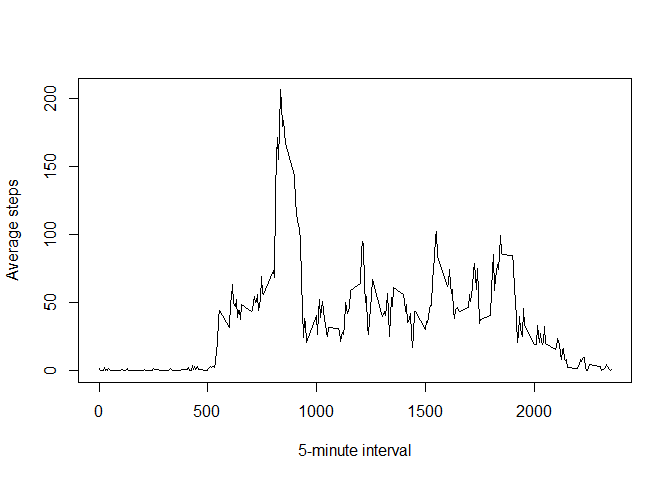
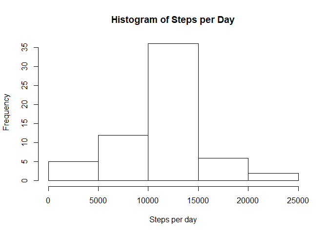
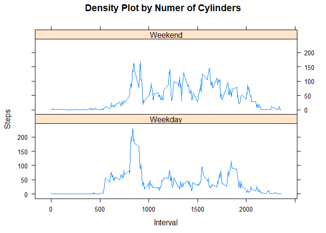

# Reproducible Research: Peer Assessment 1


## Loading and preprocessing the data


```r
unzip("activity.zip")
activity<-read.csv("activity.csv")
```


## What is mean total number of steps taken per day?


```r
perday <- aggregate(activity$steps, list(activity$date),sum)
mean(perday$x, na.rm = TRUE)
```

```
## [1] 10766.19
```

## What is the average daily activity pattern?


```r
perinterval <- aggregate(activity$steps, list(activity$interval),mean, na.rm=TRUE)
names(perinterval) <- c("interval","steps")
x<-perinterval$interval
y<-perinterval$steps
plot(x,y,type = "l",xlab = "5-minute interval", ylab = "Average steps")
```

<!-- -->

Which 5-minute interval, on average across all the days in the dataset, contains the maximum number of steps?


```r
perinterval$interval[which.max(perinterval$steps)]
```

```
## [1] 835
```


## Imputing missing values

1. Calculate and report the total number of missing values in the dataset (i.e. the total number of rows with NAs)

```r
narows <- activity$steps=="NA"
length(narows)
```

```
## [1] 17568
```
2. Devise a strategy for filling in all of the missing values in the dataset. The strategy does not need to be 
sophisticated. For example, you could use the mean/median for that day, or the mean for that 5-minute interval, etc.

I will use the mean for the given 5-minute interval.

3. Create a new dataset that is equal to the original dataset but with the missing data filled in.


```r
filledactivity <- activity
for(i in 1:nrow(filledactivity))
{
    if(is.na(filledactivity$steps[i])){
        interval <- filledactivity$interval[i]
        filledactivity$steps[i] <- perinterval$steps[
            which(perinterval$interval==interval)
            ]
    }
}
```

4. Make a histogram of the total number of steps taken each day and Calculate and report the mean and median total number of steps taken per day. Do these values differ from the estimates from the first part of the assignment? What is the impact of imputing missing data on the estimates of the total daily number of steps?


```r
perdayfilled <- aggregate(filledactivity$steps, list(filledactivity$date),sum)
names(perdayfilled) <- c("Day","Steps")
hist(perdayfilled$Steps, xlab = "Steps per day", main="Histogram of Steps per Day")
```

<!-- -->


```r
mean(perdayfilled$Steps)
```

```
## [1] 10766.19
```


```r
median(perdayfilled$Steps)
```

```
## [1] 10766.19
```

Imputting these missing values by estimatives reduces the variance, however we may lose acuracy since these values are not the result of measuments.

## Are there differences in activity patterns between weekdays and weekends?


```r
# I used this instead of weekdays() because of differences in results caused by locale settings on my machine, this approach shoud work in every computer
weekday <- as.POSIXlt(as.Date(filledactivity$date))$wday
weekday <- weekday != 0 & weekday != 6
weekend <- !weekday

intervweek <- aggregate(filledactivity$steps[weekday], list(filledactivity$interval[weekday]),mean)
intervweekend <- aggregate(filledactivity$steps[weekend], list(filledactivity$interval[weekend]),mean)
cname <- c("Interval","Steps","Weekday")
intervweek <- cbind(intervweek,rep("Weekday",nrow(intervweek)))
intervweekend <- cbind(intervweekend,rep("Weekend",nrow(intervweekend)))

names(intervweek) <- cname
names(intervweekend) <- cname

plotdata <- rbind(intervweek,intervweekend)

library("lattice")

xyplot(plotdata$Steps ~ plotdata$Interval | plotdata$Weekday, type = "l", layout = c(1,2), main="Density Plot by Numer of Cylinders", xlab = "Interval", ylab = "Steps"  )
```

<!-- -->


